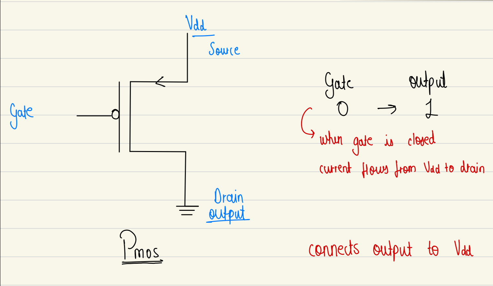
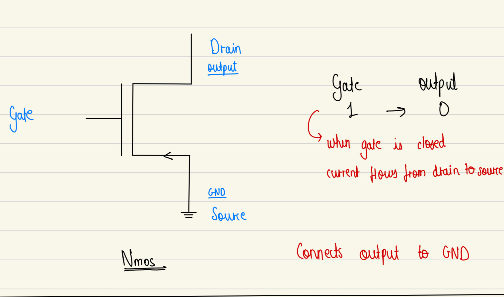

# 4 bit CPU ~ from scratch

This document contains the design and implementation of a simple 4-bit CPU built entirely using transistors within a simulator environment. The goal of this project is to understand and recreate the fundamental building blocks of a CPU — including logic gates, arithmetic units, memory, and control logic from the ground up. A 4-bit architecture was chosen to keep the design manageable and easy to debug, while still demonstrating all key concepts such as data flow, instruction execution, and program control. Despite its limited size, a 4-bit CPU is powerful enough to perform arithmetic operations, store data, and run simple programs. This document outlines each component, the thought process behind its construction, and how everything fits together to form a working CPU.

_logs can be found [here](logs/logs.md)_

## Table of Content

- Digital Logic Basics
  - Transistors
    - [PMOS & NMOS](#PMOS--and--NMOS)
  - Logic Gates
    - [AND](#and)
    - [OR](#or)
    - [NAND](#nand)
    - [NOR](#nor)
    - [XOR](#xor)

## Transistors

### PMOS and NMOS

PMOS and NMOS are two basic types of transistors used to build digital circuits.

**PMOS - p-type MOSFET**

_PMOS turns ON with 0 because it needs a low signal to let current flow_

PMOS uses holes as carriers → needs negative gate (lower voltage) to attract them.

**NMOS - n-type MOSFET**

_NMOS turns ON with 1 because it needs a high signal to let current flow_

NMOS uses electrons as carriers → needs positive gate to attract them.

Every transistor have 3 main parts:

- Emitter  
  Send out charge carriers (eg: electrons)

- Base  
  Middle Layer that controls the transistor

- Collector  
  Collects the charge carrier from the emitter

## Logic Gates

### Inverter (NOT GATE)

Inverter uses a combination of PMOS and NMOS  
This curcuit is called Complementary-MOS (CMOS) as PMOS & NMOS do opposite things

PMOS - pulls up  
NMOS - pulls down

when input is 0 current flows from VDD -> PMOS -> OUTPUT  
when input is 1 current flows from VDD -> outpu -> NMOS -> GND

| IN  | OUT |
| --- | --- |
| 0   | 1   |
| 1   | 0   |

<video width="640" controls>
  <source src="assets/videos/inverter-crumb.mp4" type="video/mp4">
  Your browser does not support the video tag.
</video>

---

### AND

| A   | B   | A AND B |
| --- | --- | ------- |
| 0   | 0   | 0       |
| 0   | 1   | 0       |
| 1   | 0   | 0       |
| 1   | 1   | 1       |

---

### OR

| A   | B   | A OR B |
| --- | --- | ------ |
| 0   | 0   | 0      |
| 0   | 1   | 1      |
| 1   | 0   | 1      |
| 1   | 1   | 1      |

---

### NAND

| A   | B   | A NAND B |
| --- | --- | -------- |
| 0   | 0   | 1        |
| 0   | 1   | 1        |
| 1   | 0   | 1        |
| 1   | 1   | 0        |

---

### NOR

| A   | B   | A NOR B |
| --- | --- | ------- |
| 0   | 0   | 1       |
| 0   | 1   | 0       |
| 1   | 0   | 0       |
| 1   | 1   | 0       |

---

### XOR

| A   | B   | A XOR B |
| --- | --- | ------- |
| 0   | 0   | 0       |
| 0   | 1   | 1       |
| 1   | 0   | 1       |
| 1   | 1   | 0       |

---
